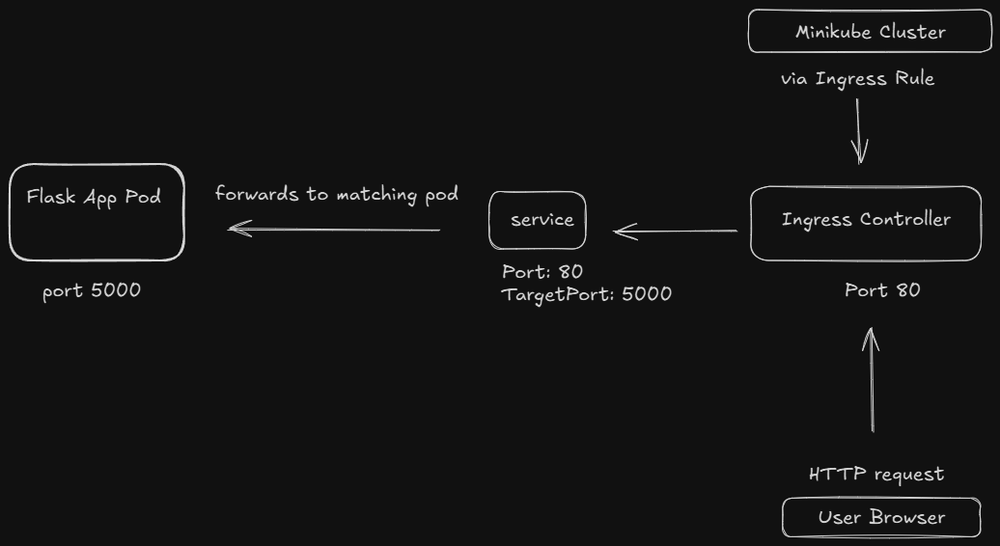

# Flask on Kubernetes with Ingress (Minikube)


This project deploys a simple Flask application on Kubernetes using Minikube and NGINX Ingress Controller. It demonstrates how to expose a Python web app through an Ingress route.

---
 
## 🚀 Stack

- Flask (Python)
- Docker
- Kubernetes (via Minikube)
- NGINX Ingress Controller
---

## 📦 1. Build & Load Docker Image into Minikube

Make sure you are using the Docker daemon inside Minikube:

```bash
minikube start
eval $(minikube docker-env)
docker build -t flask-app:latest .
```

Or use Minikube’s image loading:

```bash
minikube image load flask-app:latest
```

---

## 🧱 2. Kubernetes Deployment & Service

Apply your deployment and service:

```bash
kubectl apply -f k8s/deployment.yaml
kubectl apply -f k8s/service.yaml
```

Verify pod and service:

```bash
kubectl get pods
kubectl get svc
```

---

## 🌐 3. Enable Ingress Addon in Minikube

```bash
minikube addons enable ingress
```

Wait for the ingress controller to be ready:

```bash
kubectl get pods -n ingress-nginx
```

---

## 📥 4. Create Ingress Resource

```bash
kubectl apply -f k8s/ingress.yaml
```

Example Ingress (`k8s/ingress.yaml`):

```yaml
apiVersion: networking.k8s.io/v1
kind: Ingress
metadata:
  name: flask-app-ingress
spec:
  rules:
  - host: flask-app.local
    http:
      paths:
      - path: /
        pathType: Prefix
        backend:
          service:
            name: app1-service
            port:
              number: 80
```

---

## 📊 5. Architecture Diagram




---

## 🌍 6. Access the App via Browser

### Option A: Port Forward (For Dev)

```bash
kubectl port-forward -n ingress-nginx service/ingress-nginx-controller 8080:80
```

Then visit:

```
http://localhost:8080/
```

With custom host header:

```bash
curl -H "Host: flask-app.local" http://localhost:8080
```

### Option B: Minikube Tunnel (Recommended)

```bash
minikube tunnel
```

Get the external IP:

```bash
kubectl get svc -n ingress-nginx
```

Add to your `/etc/hosts` (or `C:\Windows\System32\drivers\etc\hosts`):

```
<external-ip> flask-app.local
```

Now visit in browser:

```
http://flask-app.local
```

---

## 🧪 Verify

```bash
curl -H "Host: flask-app.local" http://<external-ip>
```

Expected:

```
Hello from Flask!
```

---

## 📁 Folder Structure

```
.
├── app.py
├── Dockerfile
├── k8s/
│   ├── deployment.yaml
│   ├── service.yaml
│   └── ingress.yaml
├── docs/
│   └── diagram.png  ← (place your architecture image here)
└── README.md
```

---

## 🧹 Cleanup

```bash
kubectl delete -f k8s/
minikube delete
```

---

## ✨ Author

Built with ❤️ for testing Kubernetes ingress on Minikube.
